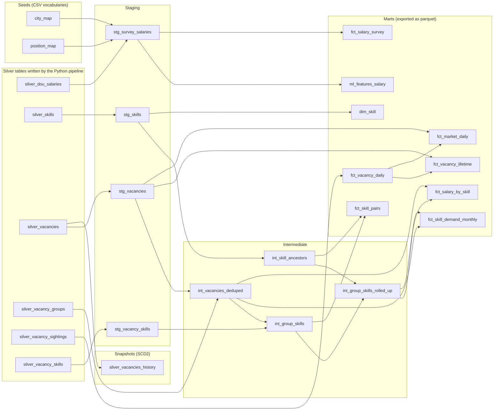

# dbt lineage

Generated by `make lineage` from the dbt manifest; a test fails when it is out of date.
Arrows go from a table to the models that read it.

```mermaid
graph LR
  subgraph sources["Silver tables written by the Python pipeline"]
    src_silver_dou_salaries[silver_dou_salaries]
    src_silver_skills[silver_skills]
    src_silver_vacancies[silver_vacancies]
    src_silver_vacancy_groups[silver_vacancy_groups]
    src_silver_vacancy_sightings[silver_vacancy_sightings]
    src_silver_vacancy_skills[silver_vacancy_skills]
  end
  subgraph seeds["Seeds (CSV vocabularies)"]
    city_map[city_map]
    position_map[position_map]
  end
  subgraph snapshots["Snapshots (SCD2)"]
    silver_vacancies_history[silver_vacancies_history]
  end
  subgraph staging["Staging"]
    stg_skills[stg_skills]
    stg_survey_salaries[stg_survey_salaries]
    stg_vacancies[stg_vacancies]
    stg_vacancy_skills[stg_vacancy_skills]
  end
  subgraph intermediate["Intermediate"]
    int_group_skills[int_group_skills]
    int_group_skills_rolled_up[int_group_skills_rolled_up]
    int_skill_ancestors[int_skill_ancestors]
    int_vacancies_deduped[int_vacancies_deduped]
  end
  subgraph marts["Marts (exported as parquet)"]
    dim_skill[dim_skill]
    fct_market_daily[fct_market_daily]
    fct_salary_by_skill[fct_salary_by_skill]
    fct_salary_survey[fct_salary_survey]
    fct_skill_demand_monthly[fct_skill_demand_monthly]
    fct_skill_pairs[fct_skill_pairs]
    fct_vacancy_daily[fct_vacancy_daily]
    fct_vacancy_lifetime[fct_vacancy_lifetime]
    ml_features_salary[ml_features_salary]
  end
  city_map --> stg_survey_salaries
  fct_vacancy_daily --> fct_market_daily
  fct_vacancy_daily --> fct_vacancy_lifetime
  int_group_skills --> fct_skill_pairs
  int_group_skills --> int_group_skills_rolled_up
  int_group_skills_rolled_up --> fct_salary_by_skill
  int_group_skills_rolled_up --> fct_skill_demand_monthly
  int_skill_ancestors --> fct_skill_pairs
  int_skill_ancestors --> int_group_skills_rolled_up
  int_vacancies_deduped --> fct_salary_by_skill
  int_vacancies_deduped --> fct_skill_demand_monthly
  int_vacancies_deduped --> int_group_skills
  position_map --> stg_survey_salaries
  src_silver_dou_salaries --> stg_survey_salaries
  src_silver_skills --> stg_skills
  src_silver_vacancies --> silver_vacancies_history
  src_silver_vacancies --> stg_vacancies
  src_silver_vacancy_groups --> int_vacancies_deduped
  src_silver_vacancy_sightings --> fct_vacancy_daily
  src_silver_vacancy_skills --> stg_vacancy_skills
  stg_skills --> dim_skill
  stg_skills --> int_skill_ancestors
  stg_survey_salaries --> fct_salary_survey
  stg_survey_salaries --> ml_features_salary
  stg_vacancies --> fct_market_daily
  stg_vacancies --> fct_vacancy_lifetime
  stg_vacancies --> int_vacancies_deduped
  stg_vacancy_skills --> int_group_skills
```
